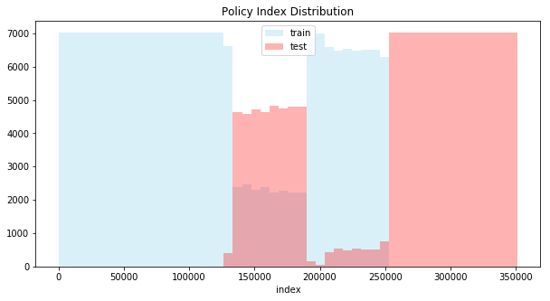
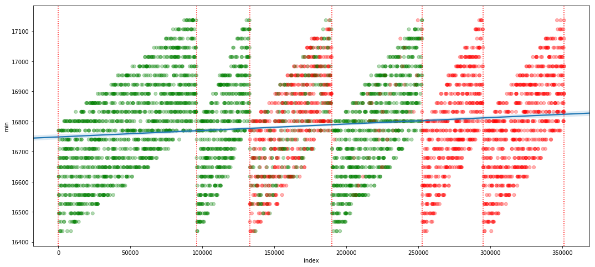
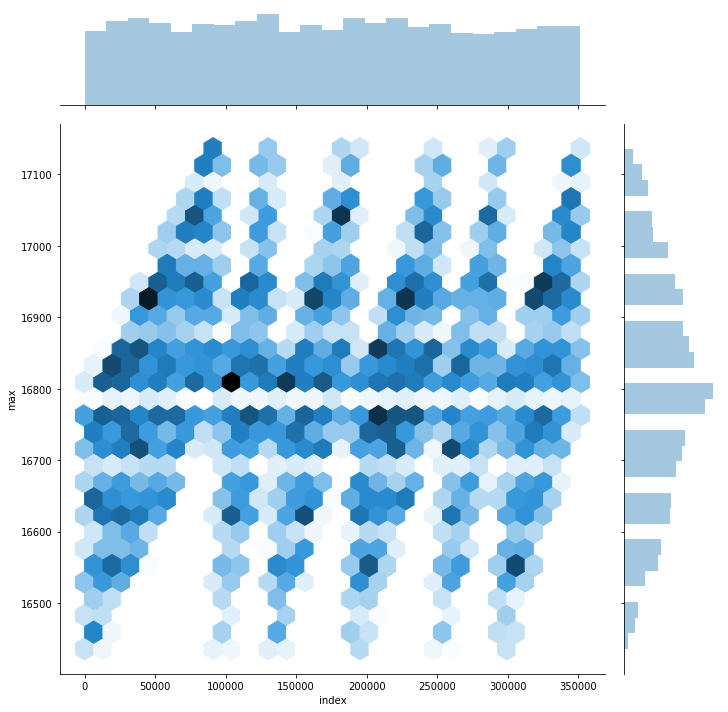
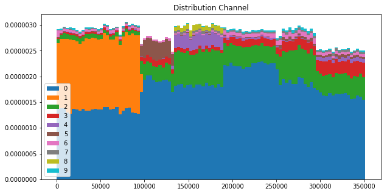
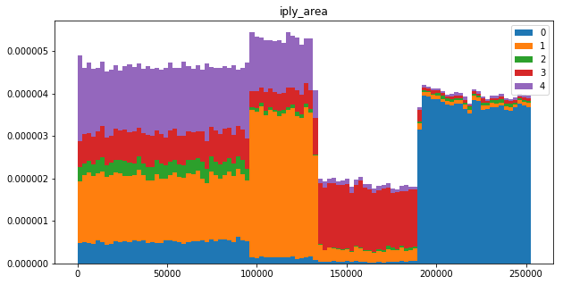

# 客戶續約金額預測

* Team name: ceshine-who
* Team Member: Ceshine Lee
* Best Submission:
  * Public Score: 1475.3827321187
  * Private Score: 1477.6742881532
* Private Leaderboard Rank: \#1
* Document Version: 1.0 (First Draft)

## 摘要

許多金融業的數據集去敏 (anonymize) 做的很徹底，*新安東京海上產險* 的這組數據集相對來說留下了比較多的原始數據，如險種、理賠單日期、被保險人生日、(可能做過轉換的) 金額數據等，在比賽剛開始的時候覺得數據組有趣所以下載下來做了一些 EDA (exploratory data analysis)，分析后決定試著參加比賽看看。

可能是因為發現了一些其他人沒發現的特徵，Public Leaderboard 分數很快就降到了 1500 以下。不過在比賽的後半段我沒有找到比較好的特徵，Public Leaderboard 分數到了 1490 以下之后和 Local CV (corss-validation) 比較脫鉤，加上之後會提到的一些讓人有些擔心的徵兆，其實我是對是否 Private Leaderboard 能否保持第一名是有點擔心的。

比賽最後的一周多時間我正好出門在外，手邊只有一臺低端 laptop，沒有最順手的開發環境，所以主要在 Google Cloud Platform 上開機器做一些 bagging 和 stacking，不过效果一般，但多了一些不同的 submissions，針對 TBrain 這個平台沒有限制最終 submission 數量的特殊情況多少做了點優化。

最後我很幸運地保留了第一名的位置，由於還沒有看到其他參賽者的解法，加上不是所有 submission 都有提供 Private Leaderboard 分數，我只能對獲勝的關鍵做粗略的猜測：

1. 特徵工程 (feature engineering) 可能是最重要的一環，其中 Policy 相關的特徵尤其重要。
2. 由於訓練集和測試集切割不是完全隨機，造成特徵值分佈不太一樣，得注意 overfitting 的問題。避免 overfitting 的其中一個方法是做 feature selection。我最好的 submission 只使用了重要度前 40 ~ 60 的特徵，多少佐證了我的這個猜測。
3. stacking 不是特別重要，雖然最好的 submission 用的是兩層的 stacking，但我懷疑一層、甚至將一些 single model 做平均都已經足以贏得比賽。
4. 將 Regression 問題改成 Classification 問題，也就是預測客戶是否會續約 (Next_Premium > 0)，訓練出的模型對 stacking 有一些幫助。

整體模型結構是 (使用 8-fold CV) :

1. 第一層： LGB Regression + Classification Models
2. 第二層： LGB Regression Stacking Models (使用第一層特徵和模型預測) + NN Stacking Models (只使用第一層模型預測)
3. 第三層： NN Stacking Models (只使用第二層模型預測)

最後將第三層的模型預測做簡單平均處理，得到 submission file。

一些 side-notes:

* 曾經嘗試在第一層訓練 NN 模型，後來有跡象顯示 NN 有 overfitting 的情況, 加上後來手邊沒有 GPU，所以沒有繼續開發
* 曾經嘗試在第一層、第二層訓練 Random Forest 模型，但因為訓練時間太長而放棄
* 比賽末期有參賽者利用 `Prior_Policy_Number`發現有錯誤的 `Next_Premium`， 讓我想起我沒有檢查是否有經過`Prior_Policy_Number`產生的 data leak。但我想如果真的有顯著的 data leak，Public Leaderboard 上應該會有跡象，所以最後我沒有花時間調查。
* 更正了錯誤的 `Next_Premium` 之後 local CV 變好了，但 Public 甚至 Private Leaderboard 分數都沒有變好，不確定是不是我更正的程式碼有 bug 導致。

最後介紹一些來自 EDA 的重要結果：

### Train-Test Split

從這張圖表來看，`policy_0702.csv` 裡面的順序似乎是有意義的，而且訓練和測試集的範圍有部分重疊、也有部分互相獨立：



### Policy Grouping <a name="policy-grouping"></a>

如果畫出有理賠的 Policy 最早的理賠日期，能更清楚顯示出 `policy_0702.csv` 的順序存在意義、並且有數個子群體。

以下是隨機抽取 5000 筆數據做出的圖，垂直線是根據圖估計出來的，可用在特徵工程上：



以下是全部數據的圖表，也可以看出理賠日期也有明顯的結構：



### Worrying Signs

一些特徵在訓練集和測試集的分佈不太一樣，會讓人擔心訓練出來的模型無法 generalize well。(除了以下兩個例子外，可能還有不少類似的情況)。





不過我做了一次簡單的測試， public-private split 貌似不 (完全) 是按照 `policy_0702.csv` 裡面的順序，這增加了 Public Leaderboard 的參考性。

## 環境

* Google Cloud Compute `n1-highcpu-8 (8 vCPUs, 7.2 GB memory)` instance
* Ubuntu 16.04
* Python 3.6.4
* Python Packages:
  - lightgbm==2.1.2
  - numpy==1.14.3
  - pandas==0.23.4
  - scikit-learn==0.19.2
  - joblib==0.12.2
  - torch==0.4.1

### NN 訓練環境

最後的 NN model 是用 CPU 做訓練和預測，如要使用 GPU，需將 `dnn_model.py` 內的這一行：

```
DEVICE = torch.device("cpu")
```

更改為

```
DEVICE = torch.device("cuda")
```

## 特徵

所有 feature engineering 都在 [features.py](../features.py) 裡面進行，並且使用 joblib 將結果存到 disk。

### 20 Most Important Features of a Regression model

| Feature Name | Gain |
| ------------ | ---- |
| total_premium | 40992399 |
| premium_車責_sum | 7298232 |
| Total_Insured_Amount | 4814410 |
| relative_position | 4530663 |
| fsex | 3698587 |
| max_premium | 2346635 |
| Insured_Amount3 | 2261685 |
| lia_class | 2256238 |
| 車責_Insured_Amount1 | 2013615 |
| min_date_smooth_1000 | 1663863 |
| Insured_Amount1 | 1636983 |
| plia_acc | 1289253 |
| premium_車損_sum | 1222081 |
| n_coverages | 1112322 |
| pdmg_acc | 1038432 |
| premium_coverage_2_sum | 806468 |
| min_premium | 629800 |
| premium_coverage_1_sum | 615626 |
| 車損_Insured_Amount3 | 545723 |
| 車責_Insured_Amount3 | 525364 |

### Categorical Variables

Categorical variables 預處理使用來自 [jeongyoonlee/Kaggler](https://github.com/jeongyoonlee/Kaggler) 的 LabelEncoder，將數據量小於 7500 的 categories 分配一個特別的數值。

* fsex
* fmarriage
* Imported_or_Domestic_Car
* Cancellation
* Vehicle_Make_and_Model1
* Distribution_Channel
* lia_class
* plia_acc
* pdmg_acc
* fassured
* same_bdate (ibirth == dbirth)

### Policy 子群體 (sub-group) 特徵

將 [之前子群體的分析](#policy-grouping) 具體轉換成為特徵，推測是能捕捉 Policy 隱藏的成立日期資訊：

1. relative_position: 該 Policy 在子群體裡面的相對位置 (0 ~ 1)
2. min_date_smooth_1000: 附近 1000 個 Policy 的平均第一個理賠日期 (忽略沒有理賠記錄的 Policy)，其實和 (1) 基本一樣，但由於 (1) 的 cutoff 是從圖表人工推測的，這個特徵提供一個自動推測的替代選項。
3. min_date_dayofyear: 附近 1000 個 Policy 的平均 day of year，試圖捕捉年度的規律 (實際上沒有什麼用)。

### Insurance_Coverage

* 和 Categorical 的預處理類似，對數據量小於 5000 的 coverage 分配一個特別的數值。
* n_coverages: 統計一個 Policy 對應的 Insurance_Coverage 數量

### Premium, Insurace_Amount{1,2,3} 相關統計數據

* total_premium，min_premium, max_premium: 同一個 Policy 的總簽單保費，最小和最大簽單保費 (如 `policy_0702.csv`，將不同 coverage 的分開來看)
* 按 `Main_Insurance_Coverage_Group`/`Insurance_Coverage` 做 groupby & sum
* Total_Insured_Amount：加總 Insurace_Amount{1,2,3}


### Claims 特徵

* 將 `Paid_Loss_Amount` 和 `paid_Expenses_Amount` 加總成為 `Total_Paid`
* 按照 `Main_Insurance_Coverage_Group`/`Insurance_Coverage` 做 groupby & sum

沒有進入最後模型的特徵：

* 清理 `At_Fault?` 之後乘以 `Total_Paid` 計算被保險人有責任的損失金額

## 訓練模型

### LGB Regression Model 參數

* 'task': 'train',
* 'boosting_type': 'gbdt',
* 'objective': 'regression_l1',
* 'feature_fraction': 0.8,
* 'bagging_fraction': 0.9,
* 'learning_rate': 0.02,
* 'bagging_freq': 1,
* 'min_data_in_leaf': 100,
* 'max_depth': 10,
* 'num_leaves': 16,
* 'cat_l2': 10,
* 'lambda_l1': 0

Parameter Optimization 顯示更高的 max_depth 和更低的 num_leaves 會有好一點的效果，但對 Public Leaderboard 分數沒有作用，推測是之前提到的 overfitting 問題，個人主觀推測應該將 max_depth 控制在 10 以下。

### LGB Classification Model 參數

* 'task': 'train',
* 'boosting_type': 'gbdt',
* 'objective': 'binary',
* 'feature_fraction': 0.5,
* 'bagging_fraction': 0.75,
* 'learning_rate': 0.01,
* 'bagging_freq': 1,
* 'min_data_in_leaf': 50,
* 'max_depth': 9,
* 'num_threads': 8,
* 'cat_l2': 20,
* 'lambda_l1': 0,
* 'lambda_l2': 0

### Ensemble 參數

由於這些參數重要性不太高，請直接閱讀 [ensemble_dnn.py](../ensemble_dnn.py)、[ensemble_lgb.py](../ensemble_lgb.py)、[ensemble_dnn_2.py](../ensemble_dnn_2.py) 程式碼。

## 訓練方式及原始碼

請參考 [README](../README.md)。

## 結論

首先要感謝主辦單位提供數據集和舉辦比賽，希望能再接再厲，帶給台灣一個優秀的機器學習競賽和學習平台。

感覺這個比賽是將 預測是否會續約 和 (若續約)預測續約的金額 兩個問題合在一起，我挺好奇用 MAE 作為評分標準和實際業務邏輯之間的差距，也想知道訓練出來的模型是否足夠提供商業價值。我由於時間所限沒有做的 Error Analysis (分析模型對哪類比較準確/不準確) 除了能幫助優化模型之外，應該也能幫助我們找到一些較為強烈的相關性、回答競賽目標 —— "到底什麼才是既有客戶續購保險商品的關鍵？"。

有些特徵和模型的想法最後也是由於時間問題沒有進入分析和實作階段，如 coverage deductible 編碼的特徵工程，嘗試篩選過特徵的 NN 等。非常期待閱讀其他參賽者的解法，應該有更多我沒有想到或實作的方法。
